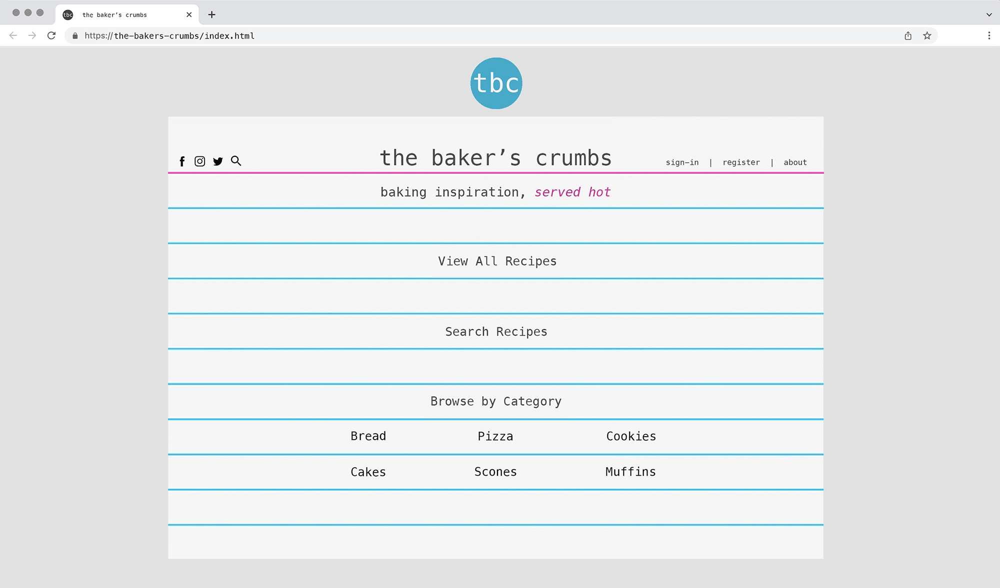
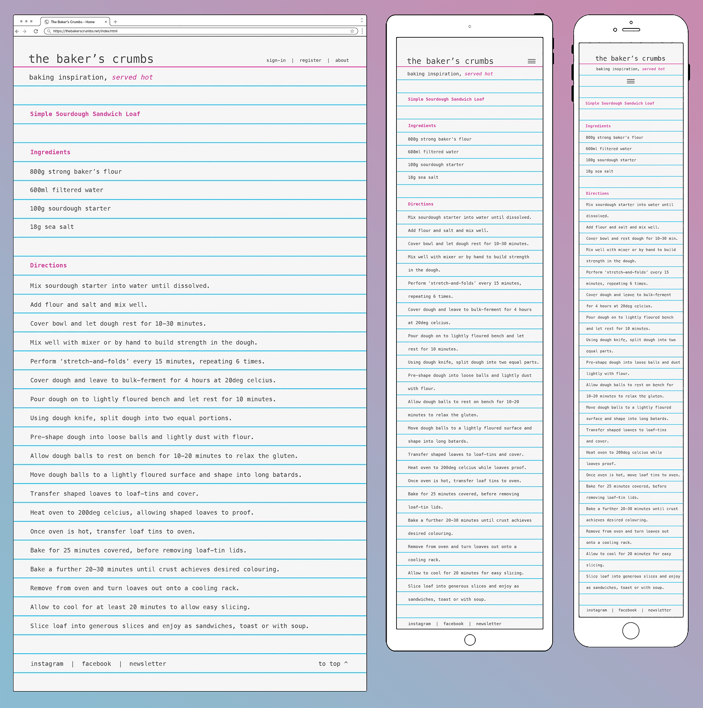
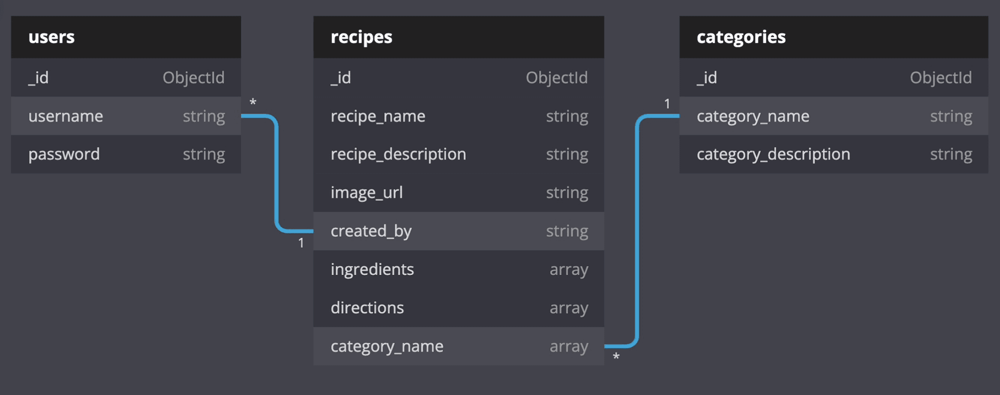

# Bakers' Crumbs
## Baking Better, Together
---
## Code Institute - Milestone 3 Project

View the live site [here](link.placeholder.com)

<!--  placeholder for site mockup image, to be added later.. 

 

-->
# Project Overview
This site was built to provide resources to people who love to bake - both experienced bakers, and also those who would like to bake but maybe lack confidence. It is a welcoming space, where first time vistors can browse existing recipes to get a taste of the site's content. However, the richest experience will become available upon creation of a user account. When logged in to their account, registered users can favourite recipes from other users for easy reference, or even submit their own recipes to share with the community along with a photo, if desired. 

The site owner is a passionate baker and active user of the site, contributing a number of tried and tested recipes. They also take on a curatorial role, with admin priveleges that allow minor editing and categorisation of user-submitted recipes for quality control and improved user experience.

---

# Table of Contents

* [UX]()
    * [User Stories](#user-stories)
        * [First-Time User Stories](#first-time-user-stories)
        * [Returning-User Stories](#returning-time-user-stories)
        * [Site Owner Stories](#site-owner-stories)

* [Strategy]()
    * [Project Goals]()
    * [Intended Users]()
    * [Site Features]()

* [Design]()
    * [Wireframes]()
    * [Color Palette]()
    * [Database Model]()

* [Structure]()
    * [Navigation]()
    * [Conventions]()
    * [Feedback]()
        - [Flash Messages]()
            * [Success Messages]()
            * [Error Messages]()
        - [Form Validation Messages]()
    * [User Flow]()
        - [Guest User Flow]()
        - [Registered User Flow]()

* [Testing]()

* [Deployment]()

* [Content]()

* [Credits]()
    * [Technologies Used]()
    * [Images]()
    * [Libraries]()

* [Special Thanks]()

---

# UX
## User Stories

This site is targeted at experienced bakers and beginner bakers alike. It is a place people can come for inspiration, browsing through the featured recipes. Equally, it is intended as a place for bakers to share their favourite recipes with fellow users. 
## First-Time User Stories
### *As a First-time User I would like to..*

- Arrive at a website that has a clear, unambiguous purpose.
- Arrive at a website that is easy to use and navigate.
- View a website that is visually engaging and pleasing to the eye.
- Browse existing recipes to get a sense of whether there are things I would like to bake myself.
- Find recipes that have ingredients cleary listed.
- Search existing recipes by category.
- Register a user account, with username and password.
- Find links to associated social media accounts.

## Returning-User Stories
### *As a Returning User I would like to..*

- Login to the website using my username and password.
- View my profile.
- Edit my account information, including:
    * Change my username.
    * Update my password.
- View recipes that I have saved on previous visits.

## Site Owner Stories
### *As Site Owner, I would like to..*

- Have a site that is welcoming and user-friendly.
- Have a site that provides a rich resource to the online baking community.
- Have a site that is ad-free, memorable, and pleasing to navigate.
#### [return to contents](#table-of-contents)

---

# Design

## Wireframes

### Home Page

##### This page greets site visitors with a quirky design aesthetic, combined with clear, concise navigation bar and links. The page content is neatly contained atop a card - referencing the index-card / catalogue-cards that were often used for sorting recipes in times-past.

### View all Recipes & View by Category

##### The wireframes seen below indicate the layout for both 'View all Recipes' and a user's chosen 'Recipes by Category' option, as accessed from the home page. If a category contains more recipes than can be displayed comfortably on a given display, pagination will be utilised for a tidy appearance and reduced dependance on scrolling.

### View Recipe Page

##### The layout of individual recipes is extremely simple and uncomplicated, referencing the recipe-cards of old that were often typed on typewriters - necessitating a basic layout. Recipes that are too long to fit on a single card continue on another.

### Add Recipe Page

### Sign-in / Sign-up Page

## Site Mockups

##### I produced mock-ups of the tbc site in addition to the wireframes to explore colour and to get a better sense of how things would look. Consideration of colour is always important. However, this is especially true here because success of the simulated lined-paper / index-card aesthetic really hinges on evoking nostalgia in the user, which means it needs to be believable.

## Color Scheme

## Database Schema

 

# Deployment

The project’s static assets are stored on GitHub Pages, which is then connected to MongoDB before deployment via Heroku using the following steps.

## Deploying Project to GitHub Pages

1. Visit https://github.com 
2. Log in to account.
3. Click “Your Repositories”, found under the user profile menu.
4. Select desired Repository, in this case “the-bakers-crumbs”.
5. Click on "Settings".
6. Under ‘Code and automation’ sub-menu, select ‘Pages’.
7. Under "Source" heading, there is a dropdown menu. Click "None". Then select ‘main’ (or ‘master’) and click ‘Save’.
8. If everything went well you will see the message "Your site is ready to be published at _______".

## Forking the Repository

This will create a replica of the repository to enable viewing or editing without any risk of affecting the original application.
1. Visit https://github.com and if you don’t already have one, create a user account.
2. Navigate to my user page:  https://github.com/thomasmcquillan
3. Select ‘Repositories’ tab.
4. Select ‘the-bakers-crumbs’.
5. Click the button named ‘Fork’, which adds a copy of the project to your repositories.

## Cloning the Repository

Cloning is another option for creating a local version of the repository to play with.  To do so, follow steps 1 - 4 from above but instead of clicking ‘Fork’ button, click on the ‘Code’ dropdown menu and choose from one of the following options:

1. Under ‘HTTPS’, copy the provided link to git repository.
2. In your preferred code editor, open a Terminal window and in the directory you want to clone the repository, type:

		$ git init

		followed by:

		$ git clone https://github.com/thomasmcquillan/the-bakers-crumbs.git
3. Hit Enter and a clone of the project will be created locally.

Alternatively, for GitHub Desktop users, click the “Open with GitHub Desktop”.

Or, simply click “Download ZIP” to download a compressed file containing a clone of the repository that you can decompress and access locally using your preferred code editor.

