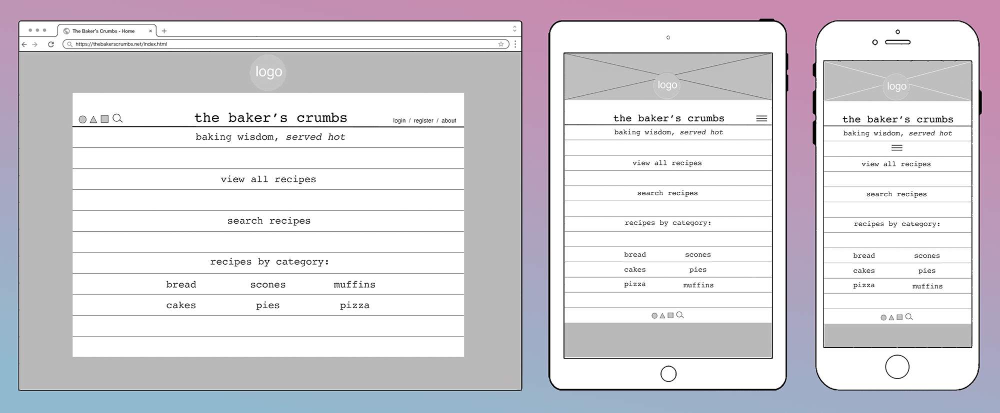
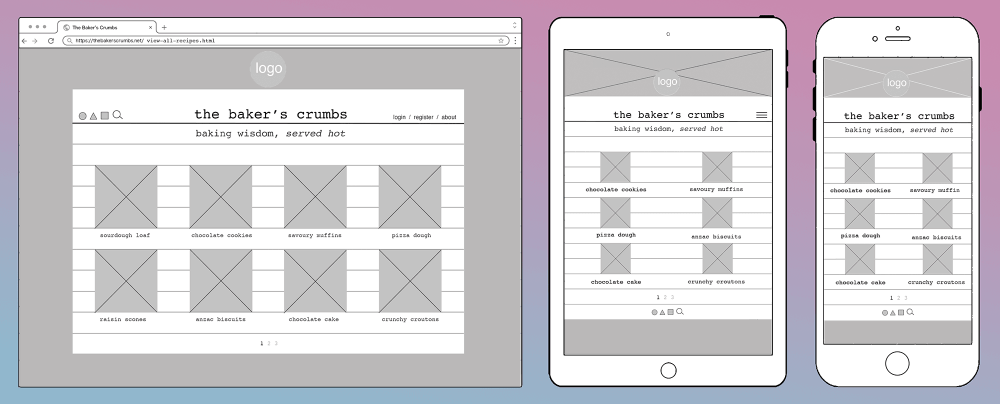
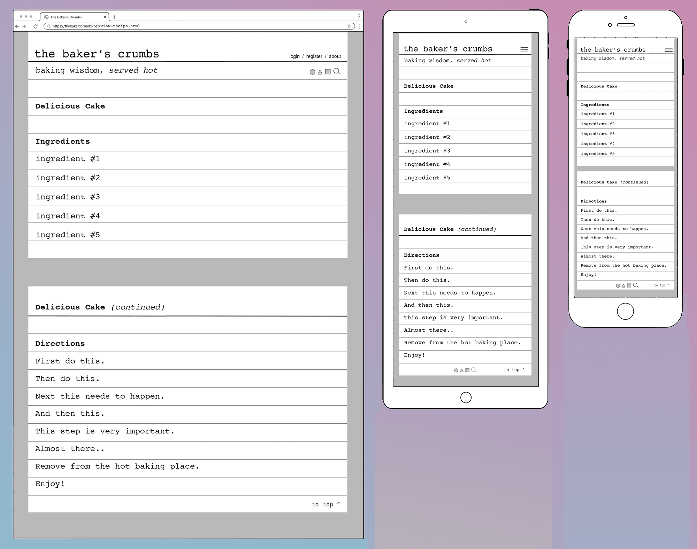
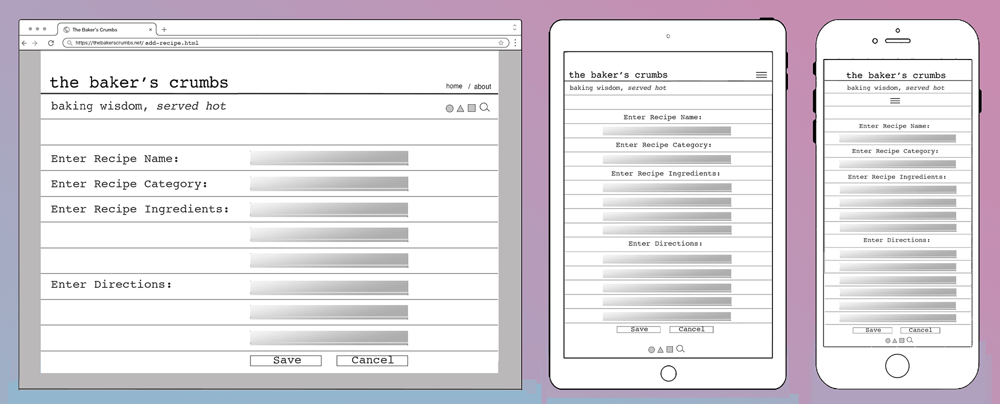
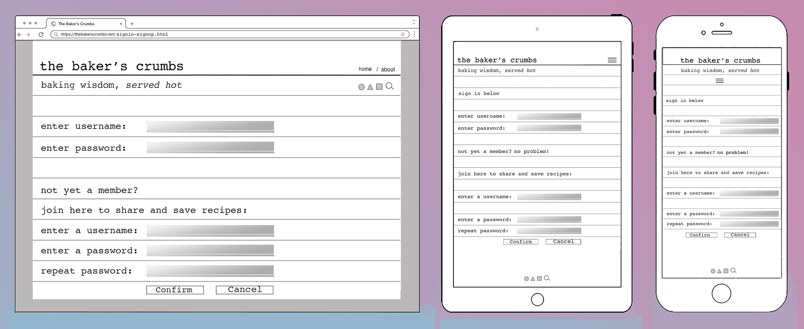
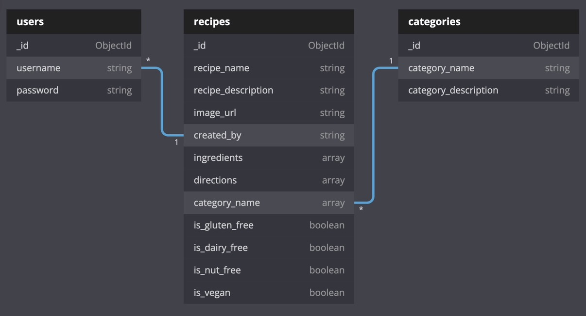

# Bakers' Crumbs
## Baking Better, Together
---
## Code Institute - Milestone 3 Project

View the live site [here](link.placeholder.com)

<!--  placeholder for site mockup image, to be added later.. 

 

-->
# Project Overview
This site was built to provide resources to people who love to bake - both experienced bakers, and also those who would like to bake but maybe lack confidence. It is a welcoming space, where first time vistors can browse existing recipes to get a taste of the site's content. However, the richest experience will become available upon creation of a user account. When logged in to their account, registered users can favourite recipes from other users for easy reference, or even submit their own recipes to share with the community along with a photo, if desired. 

The site owner is a passionate baker and active user of the site, contributing a number of tried and tested recipes. They also take on a curatorial role, with admin priveleges that allow minor editing and categorisation of user-submitted recipes for quality control and improved user experience.

---

# Table of Contents

* [UX]()
    * [User Stories](#user-stories)
        * [First-Time User Stories](#first-time-user-stories)
        * [Returning-User Stories](#returning-time-user-stories)
        * [Site Owner Stories](#site-owner-stories)

* [Strategy]()
    * [Project Goals]()
    * [Intended Users]()
    * [Site Features]()

* [Design]()
    * [Wireframes]()
    * [Color Palette]()
    * [Database Model]()

* [Structure]()
    * [Navigation]()
    * [Conventions]()
    * [Feedback]()
        - [Flash Messages]()
            * [Success Messages]()
            * [Error Messages]()
        - [Form Validation Messages]()
    * [User Flow]()
        - [Guest User Flow]()
        - [Registered User Flow]()

* [Testing]()

* [Deployment]()

* [Content]()

* [Credits]()
    * [Technologies Used]()
    * [Images]()
    * [Libraries]()

* [Special Thanks]()

---

# UX
## User Stories

This site is targeted at experienced bakers and beginner bakers alike. It is a place people can come for inspiration, browsing through the featured recipes. Equally, it is intended as a place for bakers to share their favourite recipes with fellow users. It also seeks to accommodate users who follow special diets, such as vegans, vegetarians or allergy sufferers.

## First-Time User Stories

### *As a First-time User I would like to..*

- Arrive at a website that has a clear, unambiguous purpose.
- Arrive at a website that is easy to use and navigate.
- View a website that is visually engaging and pleasing to the eye.
- Browse existing recipes to get a sense of whether there are things I would like to bake myself.
- Find recipes that have ingredients cleary listed.
- Filter recipes by category, with the option to exclude nuts / dairy / gluten etc, when baking for people with special dietary requirements.
- Search existing recipes, filtered by category.
- Register a user account, with username and password.
- Find links to associated social media accounts.

## Returning-User Stories

### *As a Returning User I would like to..*

- Login to the website using my username and password.
- View my profile.
- Edit my account information, including:
    * Change my username.
    * Update my password.
- View recipes that I have saved on previous visits.

## Site Owner Stories

### *As Site Owner, I would like to..*

- Have a site that is welcoming and user-friendly.
- Have a site that provides a rich resource to the online baking community.
- Have a site that is ad-free, refined and pleasing to navigate - in stark contrast to the majority of online baking websites today.
#### back to [contents](#table-of-contents)

---

# Design

## Wireframes

### Home Page

##### This page greets site visitors with a quirky design aesthetic, combined with clear, concise navigation bar and links. The page content is neatly contained atop a card - referencing the index-card / catalogue-cards that were often used for sorting recipes in times-past.

### View all Recipes & View by Category

##### The wireframes seen below indicate the layout for both 'View all Recipes' and a user's chosen 'Recipes by Category' option, as accessed from the home page. If a category contains more recipes than can be displayed comfortably on a given display, pagination will be utilised for a tidy appearance and reduced dependance on scrolling.

### View Recipe Page

##### The layout of individual recipes is extremely simple and uncomplicated, referencing the recipe-cards of old that were often typed on typewriters - necessitating a basic layout. Recipes that are too long to fit on a single card continue on another.

### Add Recipe Page

### Sign-in / Sign-up Page

## Color Scheme

## Database Schema

 